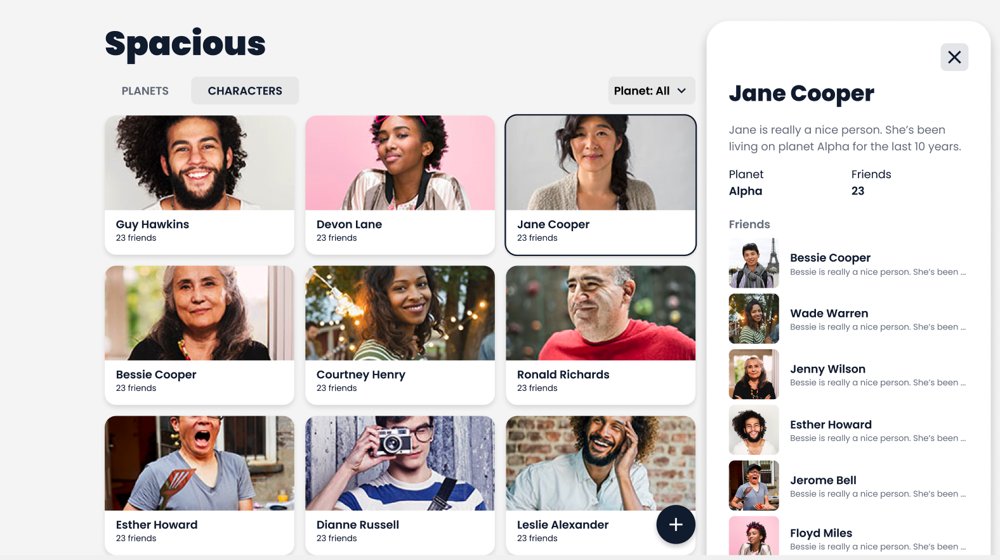

# Full-stack assessment

Welcome to the Strapi full-stack assessment 🙂

This assessment is about checking whether you and Strapi are a good fit, technically. We expect you to show what you know and what you like to do (and it's okay not knowing everything).

The goal of the assessment is to create an app (back-end and front-end) that manages planets and characters entities by following the requirements specified below.

You have 7 days to do the assessment and send it back to us.

Feel free to ask questions. Don't stay stuck for too long if you have difficulties or are missing information.

You may want to keep track of specific choices you make so you can explain them to us later.

We hope you'll have fun doing it 🙂 good luck!

## Context

You just saw the Star Wars movies and you really liked them (even though there are some scenario choices you're not sure you approve). You've decided to join a Star Wars fan group to talk about your new interest and you've met them for the first time yesterday evening, it went really well. They are interested that you are a developer and would like you to develop something for the group.

Here is what they tell you:

"We currently have the project of imagining a new world where adventures can happen. We imagine the planets and characters of this world but it's difficult to keep track of what we have already done on paper. It would be nice to have an app to easily manage the content of our new world. The idea is to be able to create and view the planets and the characters. What do you think? We all are developers too but we don't currently have the time to develop it. Would you be interested in developing it?"

Enthusiastic to help your new group of friends, you accept.

One week later, you send them the app you wrote so they can run it locally and give you feedback both on the functionalities of the app and the code quality.

## Requirements

### General

- Use `git` to version your code
- Use `docker` so anyone can run the project
- Write some relevant tests
- Use the required libraires specified below, you can use more if needed
- Follow the provided [Functional specifications](#functional-specifications)
- Provide a way to seed the database with
    - [./ressources/seeds/planets.json](./ressources/seeds/planets.json)
    - [./ressources/seeds/characters.json](./ressources/seeds/characters.json)
- Feel free to use the [./ressources/additional-assets](./ressources/additional-assets) or not ; there are here only to help you

### Back-end

You'll develop a GraphQL service to create and read information about planets and characters.

- The backend must be developed with `Node.js`
- The database must be `PostgreSQL`
- The server must run on port `3000`
- The service must be accessible through a GraphQL endpoint at `/graphql`
- The GraphQL endoint must me protected by a bearer token that you provide
- Use `koa` to create the server
- Use `apollo-server` to add the GraphQL endpoint
- Use `knex` for database migration and querying (do not use an ORM)
- Follow the provided [Data and GraphQL specifications](./data-and-graphql-specifications.md)

**Bonus**: if you have extra time and want to have fun you can do the following:

- Use some `DataLoader` to improve query perfomances
- Add the field `averageFriendsOfFriends` to the `Character` type: the value is the average number of friends that his/her friends have

### Front-end

You'll develop an application that consumes the GraphQL service you wrote in order to manage the planets and characters.

- Use `React` and `create-react-app`
- Use `apollo-graphql` for querying the GraphQL service
- Use `styled-components`
- If you're not comfortable with a certain part of the exercise, feel free to choose alternatives and to mention them.
- The designs to follow are available on [Figma](https://www.figma.com/file/XeCg0NBCPIB9lAj474Ceau/Strapi---fullstack-technical-test?node-id=0%3A1)
- You'll find additional design explanations in this [short video](https://www.loom.com/share/fc812639654b4884963615db6d825a53)
- Use the provided assets at: [./ressources/assets](./ressources/assets)

## Functional specifications

With this application, the user should be able to manage **their favorites planets and the characters living on them**.

In the following specifications, there are many things to implement. However, everything related to "friendships" is optional and will be considered a "bonus". It's not the part we hope you'll invest too much effort and time in.

### Acceptance tests

#### As a regular user,

Given that **I am on the `planets` tab and being on the `/` URL**

- I'm provided with a **list of all the planets**.
- When I **press the "+" button** a the bottom right of the planet grid, **I'm redirected to the planet creation page at `/planets/create`**.
- When **I select a specific planet** on the planet grid, I'm provided with **a sidebar showing all the characters living on this planet**.
    - With the card of characters living on the planet visible, when **I press the "+" button** at the bottom right of the character list, **I'm redirected to the character creation page at `/characters/create`**.

Given **I am on the `characters` tab and being on the `/characters` URL**

- I'm provided with **a list of all the characters on all planets**.
- When I **press the "+" button** a the bottom right of the character grid, **I'm redirected to the planet creation page at the `/characters/create`** page.
- When **I select a specific character** on the character grid, I'm provided with **a sidebar showing the character details and a list of all of their friends**.
- When **I select the "Planet all" filter** at the top right of the character grid, I'm provided with a dropdown showing all the planets.
    - With the dropdown opened, **when I select a planet**, **it filters the list of characters in the character grid and only shows the ones living on the selected planet**.

Given **I'm on the character creation page (`/characters/create`)**

- **I can fill the character image URL** field (it's a required field).
- **I can fill the character name** field (it's a required field with a maximum content of 20 characters).
- **I can fill the character description** field (it's a required field, with a minimum content of 15 characters and a maximum content of 300 characters).
- **I can fill the friends** field (it's an optional field).
- **When submitting the form - and everything is valid** -, **I'm redirected to the character list on the `/characters` URL. The new character is the first in the list and is highlighted somehow** (it's up to your imagination).

Give I'm on the planet creation page (**`/planets/create`**)

- **I can fill the planet image URL** field (it's a required field).
- **I can fill the planet name** field (it's a required field with a maximum content of 20 characters).
- **I can fill the planet description** field (it's a required field, with a minimum content of 15 characters and a maximum content of 300 characters).
- **When submitting the form - and everything is valid** -, **I'm redirected to the planet list on the `/` URL**. **The new planet is the first on the list and is highlighted somehow** (it's up to your imagination).
